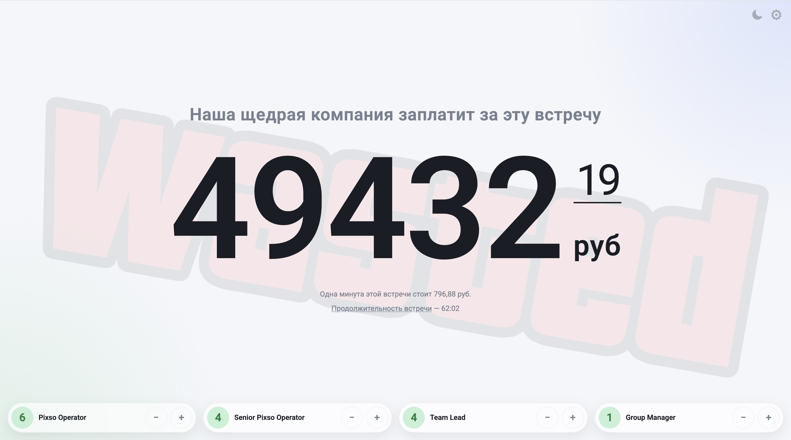

# Resource Waste Tracker

Небольшое клиентское веб-приложение для оценки стоимости встречи по составу участников и длительности.

Пользователь указывает количество участников, их должности и оклады и на странице в реальном времени считается стоимость встречи.



## Возможности

- расчёт стоимости встречи в реальном времени
- отображение стоимости одной минуты встречи
- учёт длительности встречи с возможностью вручную задать время старта
- настройка заголовка страницы
- настройка списка должностей: название, оклад, добавление и удаление
- автоматическая сортировка по окладу от меньшего к большему
- переключение светлой и тёмной темы
- сохранение настроек и темы в `localStorage`

## Как запустить

Так как проект статический, достаточно открыть [index.html](/index.html) в браузере.

## Как пользоваться

1. На основной странице укажите количество участников кнопками `+` и `−`.
2. При первом добавлении участника таймер встречи стартует автоматически.
3. Клик на `Продолжительность встречи` - изменить время начала.
4. Через иконку настроек в правом верхнем углу можно:
   - изменить заголовок
   - изменить, добавить и удалить должности участников

## Логика расчёта

Стоимость минуты для каждого грейда считается по формуле:

```text
ratePerMinute = (salary * 1.5) / (160 * 60)
```

Где:
- `salary` — месячный оклад
- `1.5` — коэффициент стоимости грубо учитыающий налоги и отчисления в страховые фонды
- `160` — число рабочих часов в месяце

Общая стоимость встречи считается как сумма стоимости минут всех выбранных участников, умноженная на прошедшее время встречи.


## Структура проекта

- [index.html](/index.html) — разметка страницы, тулбар, модальное окно настроек
- [styles.css](/styles.css) — темы, layout, стили карточек и модалки
- [app.js](/app.js) — состояние приложения, расчёты, рендер, `localStorage`
- [assets/wasted.png](/assets/wasted.png) — фоновой декоративный asset

## Автор
[Konstantin Kuzin](https://t.me/K_u_z_i_n)
